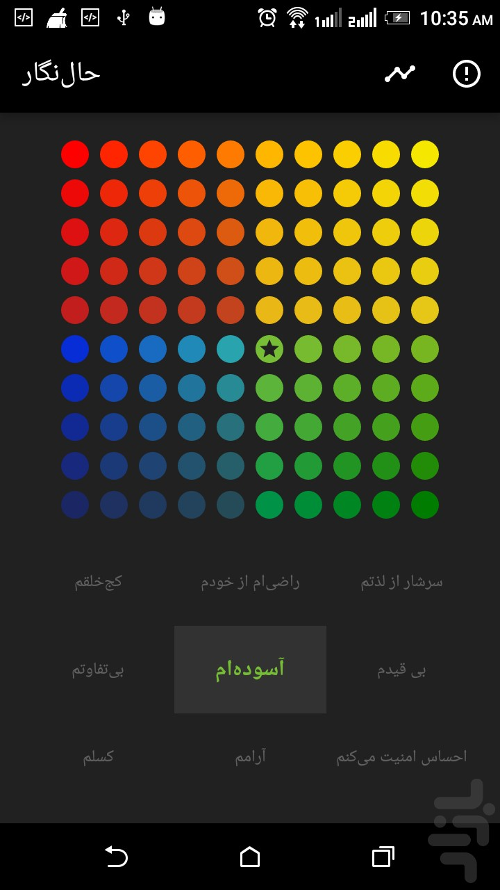

# HalNegar
The HalNegar builds emotional intelligence. Use it to:
· Check-in regularly with your feelings
· Expand your emotional vocabulary
· Learn what causes you to feel the way you
· Learn effective strategies to help you regulate your feelings
 

Authors: Ehsan Maiqani, Soroush Nasri

# Screenshot

# Video
Watch [this vidoe](https://www.aparat.com/v/gVKCH) for durther information about how the application works.